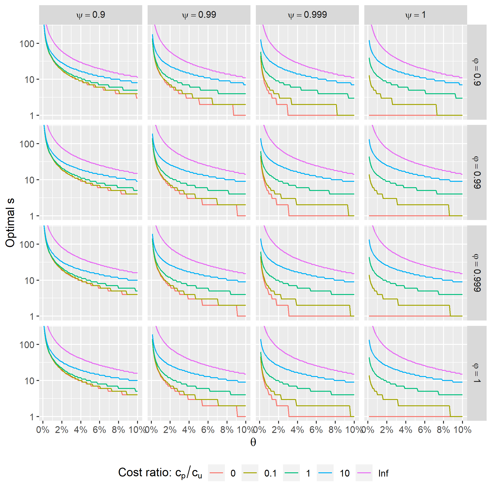
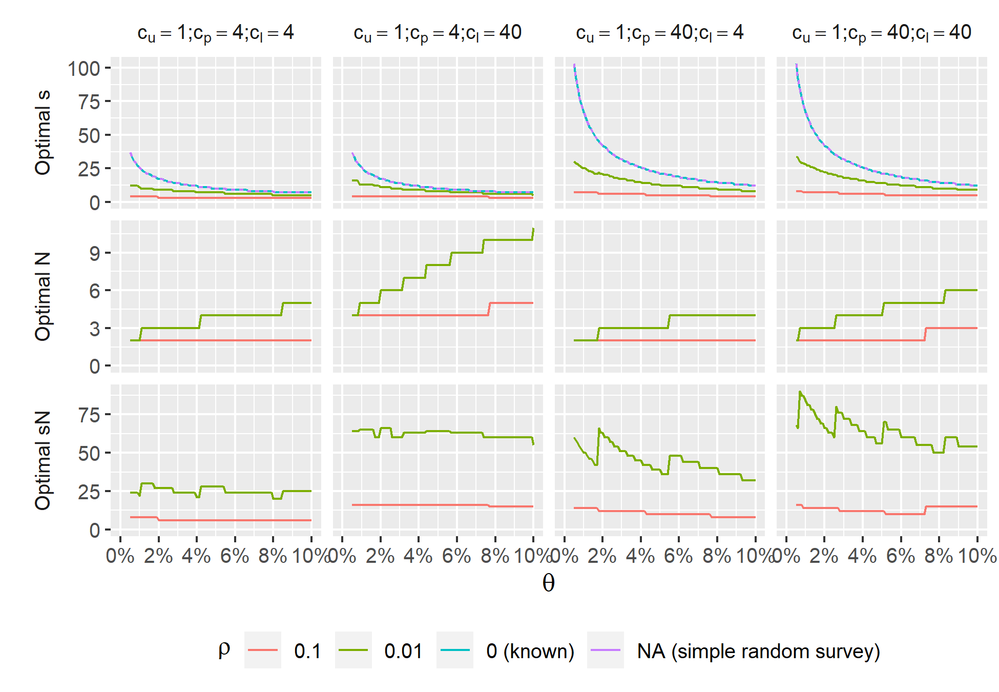

```{r setup, include=FALSE}
knitr::opts_chunk$set(echo = FALSE)
```

## Pooled (AKA Group) Testing

- Pooled testing:

  Any time you test groups of items instead of individuals

- Why?

  It might be cheaper, faster, or easier than individual testing *if prevalence is low*
  
- Why not?
  
  It complicates data analysis!

## Pooled Testing Example: Molecular Xenomonitoring
::: columns

:::: column


::::

:::: column


::::

:::

## Pooled Testing Example: Molecular Xenomonitoring  {.flexbox .vcenter}


## Pooled Testing

Pooled testing can mean many things, but I am interested in:

- Binary outcome
- Tests are applied to groups of non-overlapping individuals
- Number of individuals in a pool (aka pool size) is known
- Interest is the presence/absence or prevalence of positive outcomes
- It is not possible to determine which or how many individuals in a positive group are positive

## Pooled Testing

Possible complications:

- Test might be imperfectly sensitive or specific
- Pool sizes might be different (or even random)
- Sampling design: simple random or cluster random

## Pooled Testing

Related but different:

- Pooled tests with a quantitative outcome (e.g. sewerage testing, qPCR)
- Pools where the number of individuals in each pool is unknown (e.g. sewerage testing)
- Where individuals from positive pools are re-tested (Dorfman screening or similar)


## Pool Testing Complicates Everything

- Estimation of prevalence:
    - Proportion of positive pools $>>$ prevalence
    - Maximum Liklihood Estimate (MLE) is better but is only asymptotically unbiased
    - PoolTestR only pacakge that allows prevalence estimate that accounts for clustering
- Open questions:
  - Sample size for prevalence estimation?
  - Optimal pool size?
  - Equal or unequal pools?
  - For cluster surveys, number of units per cluster?
  - What if samples per location is random?
  
> How much information do different sampling/pooling designs give you?

## Fisher Information

$$
\begin{align}
I(\theta) & = E\left[\left(\frac{\partial}{\partial \theta} \log(L(\theta|X))\right)^2\right] \\
          & = E\left[\left(l_\theta(\theta|X)\right)^2\right] \\
          & = -E\left[l_{\theta\theta}(\theta|X)\right] \\
\end{align}
$$

## Fisher Information: Handy Properties
 - Additive for independent data:
$$\
I_{X_1, X_2}(\theta) = I_{X_1}(\theta) + I_{X_2}(\theta)
$$
 - Maximum likelihood estimator with lots of data $X_1,\dots X_n$:
$$
\hat{\theta}_n \to Normal\left(\theta, \frac{1}{nI(\theta)}\right)
$$

## Fisher Information: multiple parameters
$$
\begin{align}
I(\theta, \rho) 
&=
E \begin{bmatrix}
 l_\theta(\theta, \rho|X) ^2 &
 l_\theta(\theta, \rho|X) l_\rho(\theta, \rho|X)\\
 l_\theta(\theta, \rho|X) l_\rho(\theta, \rho|X) &
 l_\rho(\theta, \rho|X) ^2\\
\end{bmatrix}\\
& = -E \begin{bmatrix}
 l_{\theta\theta}(\theta, \rho|X) &
 l_{\theta\rho}(\theta, \rho|X)\\
 l_{\rho\theta}(\theta, \rho|X) &
 l_{\rho\rho}(\theta, \rho|X)\\
\end{bmatrix}\\
\end{align}
$$
 - Maximum likelihood estimator with lots of data $X_1,\dots X_n$:
$$
\begin{bmatrix}
 \hat{\theta}_n\\
 \hat{\rho}_n\\
\end{bmatrix}
\to MN\left(
\begin{bmatrix}
\theta \\
\rho \\
\end{bmatrix}, \frac{I(\theta,\rho)^{-1}}{n}\right)
$$

## Simple random surveys - single pool size
- Setup:
  - $s$ common pool size
  - $N$ number of pools
  - $Y$ the number of positive results
  
> - Likelihood (perfect test)
$$
\begin{align}
L(\theta|y)
&= P(Y = y|\theta,N,s) \\
&= {N \choose y} {(1 - (1-\theta)^{s})}^{y} (1-\theta)^{s(N-y)}
\end{align}
$$

> - Fisher information
$$
\begin{align}
I(\theta|N,s)
= N\frac{s^2(1-\theta)^{s-2}}{1 - (1-\theta)^s}\\
\end{align}
$$

## Simple random surveys - many pool sizes
- Setup:
  - $\underline{s} = [s_1,\dots,s_K]$ vector of pool sizes
  - $\underline{N} = [N_1, \dots, N_K]$ number of pools of each size
  - $\underline{s}\cdot\underline{N} = n$ total number of units
  - $\underline{Y} = [Y_1,\dots, Y_K]$ the number of positive pools

> - Likelihood
$$
\begin{align}
L(\theta|\underline{y}) = \prod_{k = 1} ^K {N_k \choose y_k} {(1 - (1-\theta)^{s_k})}^{y_k} (1-\theta)^{s_k(N_k-y_k)}
\end{align}
$$

> - Fisher information
$$
\begin{align}
I(\theta|\underline{N},\underline{s})
= \sum_{k = 1}^K I(\theta|N_k,s_k) = \sum_{k = 1}^K N_k\frac{s_k^2(1-\theta)^{s_k-2}}{1 - (1-\theta)^{s_k}}\\
\end{align}
$$

## Simple random surveys - many pool sizes and imperfect test
Setup:

::: columns

:::: column
  - $\underline{s} = [s_1,\dots,s_K]$ vector of pool/group sizes
  - $\underline{N} = [N_1, \dots, N_K]$ number of pools/groups
  - $\underline{s}\cdot\underline{N} = n$
  - $\underline{Y} = [Y_1,\dots, Y_K]$ the number of positive results
  
::::

:::: column

>  - $\psi$ the specificity of the test
>  - $\varphi$ the sensitivity of the test
>  - $\phi_s(\theta) = (1-\psi)(1-\theta)^s + \varphi (1 - (1-\theta)^s)$ the probability a pool tests positive (given $s$ and $\theta$).  
  
::::

:::

> - Likelihood
$$
L(\theta|\underline{y}) = P(\underline{Y} = \underline{y}|\theta,\underline{N},\underline{s},\varphi,\psi) = \prod_{k = 1} ^K {N_k \choose y_k} {\phi_{s_k}(\theta)}^{y_k} (1-\phi_{s_k}(\theta))^{N_k-y_k}
$$
> - Fisher information
$$
\begin{align*}
I(\theta|\underline{N}, \underline{s},\varphi,\psi)
&= (1-\varphi-\psi)^2\sum_{k = 1}^K N_k \frac{s_k^2(1-\theta)^{2s_k-2}}{\phi_{s_k}(\theta)(1-\phi_{s_k}(\theta))}\\
\end{align*}
$$

<!-- - compare individually tested units -->
<!-- $$ -->
<!-- \begin{align} -->
<!-- I(\theta|N,s) -->
<!-- = N\frac{1}{(1-\theta)\theta}\\ -->
<!-- \end{align} -->
<!-- $$ -->

## Design Effect - Comparing information between designs

> - Design effect:
$$
D(\theta,\underline{N},\underline{s},\varphi,\psi) = \frac{I(\theta|1,1,\varphi,\psi) \underline{N}\cdot\underline{s},}{I(\theta|\underline{N},\underline{s},\varphi,\psi)}.
$$
> - For a perfect test ($\psi = \varphi = 1$) and a common pool size
$$
D(\theta,N,s,1,1) = \left[ \theta^{-1} - 1\right]\left[(1-\theta)^{-s} - 1\right] \geq 1.
$$
> - For $s>1$ design effect improves (gets smaller) as we approach zero prevalence.
$$
\lim_{\theta \to 0} D(\theta, N, s, \varphi,\psi) =
\begin{cases}
1 & \psi = 1\\
1/s & \psi <1
\end{cases}
$$

## Design Effect  {.flexbox .vcenter}


## Design Effect - Imperfect Specificity {.flexbox .vcenter}


## Design Effect - Imperfect Sensitivity {.flexbox .vcenter}


## Optimal Pool Size: Setup

- $c_u$ marginal cost of sampling one unit
- $c_p$ cost of one pool (independent of the number of units in the pool).

Choose $s$ that maximizes the marginal cost of a 'unit' of Fisher Information
$$
m(s|\theta, \varphi, \psi, c_u, c_p) = \frac{c_u s + c_p}{I(\theta|1,s, \varphi, \psi)}.
$$

## Optimal Pool Size
:::columns

::::column


::::

::::column

$c_p/c_u = 4$ 

::::

:::

## Optimal Pool Size  {.flexbox .vcenter}


## Optimal Pool Size  {.flexbox .vcenter}



## Cluster surveys  {.flexbox .vcenter}


## Cluster surveys individual testing

Setup:

- $n$ units are sampled from $J$ location ($n/J$ per location).
- $V_{ij}$ are *correlated* Bernoulli RVs: presence/absence in unit $i$ from location $j$
$$
Corr(V_{ij},V_{i'j'}) = \begin{cases}
1, & i = i', j = j' \\
\rho, & i \neq i', j = j' \\
0, &  j \neq j' \\
\end{cases}
$$
This is *not* a unique description of the correlation structure

## Cluster surveys individual testing

Regardless of higher-order correlation structure, the standard population prevalence estimator
$$
\hat{\theta} = \frac{1}{n} \sum_i\sum_j V_{ij}
$$
has standard error
$$
se(\hat{\theta}) = \sqrt{\dfrac{\hat{\theta}(1-\hat{\theta})D}{n}}  = \sqrt{\dfrac{\hat{\theta}(1-\hat{\theta})}{n_{eff}}}
$$
with design effect $D = 1 + \rho (n/J - 1)$ and effective sample size $n_{eff} = n/D$.

Two problems:

> - This (standard) approach assumes that $\rho$ is known and only $\theta$ is estimated
> - It doesn't work for pooled tests. :(

## Cluster Survey Pooled Testing

> - We have to specify the full correlation structure: joint distribution of $\{V_{ij}\}$
> - Model prevalence at each location ($\Theta_j$), with units being independent conditioned on the location:
> -  $E[\Theta_j] = \theta$ and $f_\Theta(p)$ is density on $[0,1]$.
$$
V_{ij}|\Theta_j \sim Bern(\Theta_j),
$$

> - This preserves $E[V_{ij}] = \theta$.
> - Correlation between two distinct units from the same site, $\rho$, is
$$
\begin{align*}
\rho := Corr(V_{ij},V_{i'j})
&= \frac{Var[\Theta_j]}{\theta (1-\theta)}.
\end{align*}
$$


## Cluster Survey Pooled Testing
> - Likelihood (and Fisher Information) depends on the first $\underline{s} \cdot \underline{N}$ moments of $\Theta_j$
> - specifying $\theta$ and $\rho$ will not be sufficient for $\underline{s} \cdot \underline{N}>2$
> - Distributions for $\Theta_j$: e.g. beta, logit-normal.
> - The model is not identifiable if $N = 1$. (Fisher Information matrix is not invertible)


## Fisher Information - Beta Distribution


## Fisher Information - Beta Distribution


## Unit information - beta


## Unit information - beta


## Optimal cluster


